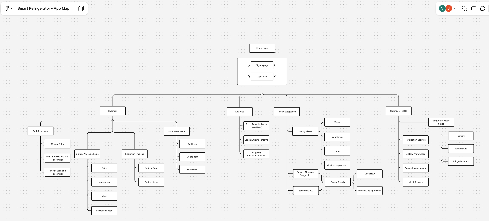
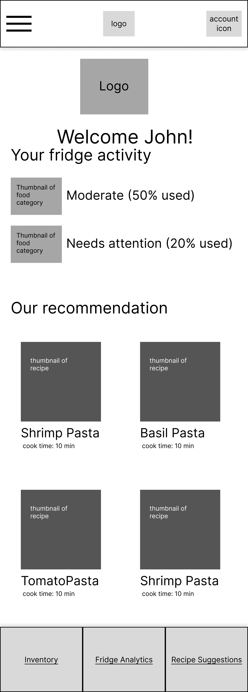

# User Experience Design

## Prototype 

[Smart Fridge prototype](https://www.figma.com/proto/FEZufBYCT12g1D6v3p72oF/Smart-Refridgerator?node-id=25-3&p=f&t=UdpG8Y7Feh7grwMe-1&scaling=scale-down&content-scaling=fixed&page-id=0%3A1&starting-point-node-id=25%3A3&show-proto-sidebar=1)

Following is the link to our Figma prototype. Please click on the blank space to find interactable element if you are lost (and feel free to comment any confusions you encounter!)

## app map & wireframe
### app map
- [app map (FigJam file)](https://www.figma.com/board/B6bl884Eaoly3tL2WfJ9RB/Smart-Refrigerator---App-Map?t=qfjXErelkULvO4SU-1)
- [app map(Local FigJam file)](ux-design/app-map/Smart-Refrigerator-App-Map.jam)

### wireframe
- [wireframe (Figma file)](https://www.figma.com/design/FEZufBYCT12g1D6v3p72oF/Smart-Refridgerator?node-id=0-1&t=EDmePhkOCfPJ2SYz-1)
- [wireframe (Local Figma file)](ux-design/wireframes/Smart-Refridgerator.fig)
 Please be mindful that figma file will be updated ocassionaly - please check the web version for most recent version

| Screen Name | Wireframe | Description |
|------------|-----------|-------------|
| **Home Screen** |  | The main dashboard displaying key refrigerator stats, recommendation, and quick actions. |

#### Settings & Profile
| Screen Name | Wireframe | Description |
|------------|-----------|-------------|
| **Settings and Profile** |  | The main dashboard displaying navigation buttons. |
| **Account Settings** |  | Important account setup including profile, password, and data consent |
| **Refrigerator Model Setup** |  | Dashboard for configuring fridge model for optimal app usage |
| **Notification Setup** |  | Preference for notification on various features |
| **Dietary Preference** |  | Important dietary restrictions / preference setting |
| **Help and Support** |  | general help and contact area for frequently asked questions |
| **Change Password** |  | Secure page to change password of account |

### Login & Signup
| Screen Name | Wireframe | Description |
|------------|-----------|-------------|
| **Log in Page** |  | The Login Page used for user to track saved data and other informations. |
| **Sign Up Page** |  | The Sign Up Page used for user to create a new account to save data and other informations. |

### Analytics
| Screen Name | Wireframe | Description |
|------------|-----------|-------------|
| **Trend Analysis Page** |  | Displays the most and least used food items in the fridge, helping users understand consumption patterns and optimize grocery shopping. |
| **Shopping Recommendation Page** |  | Suggests essential grocery items and replenishment recommendations based on inventory levels and waste patterns, with direct links to online stores. |
| **Waste Pattern Page** |  | Tracks food waste over a selected time period, providing insights into the most wasted food categories and estimated financial loss. |

