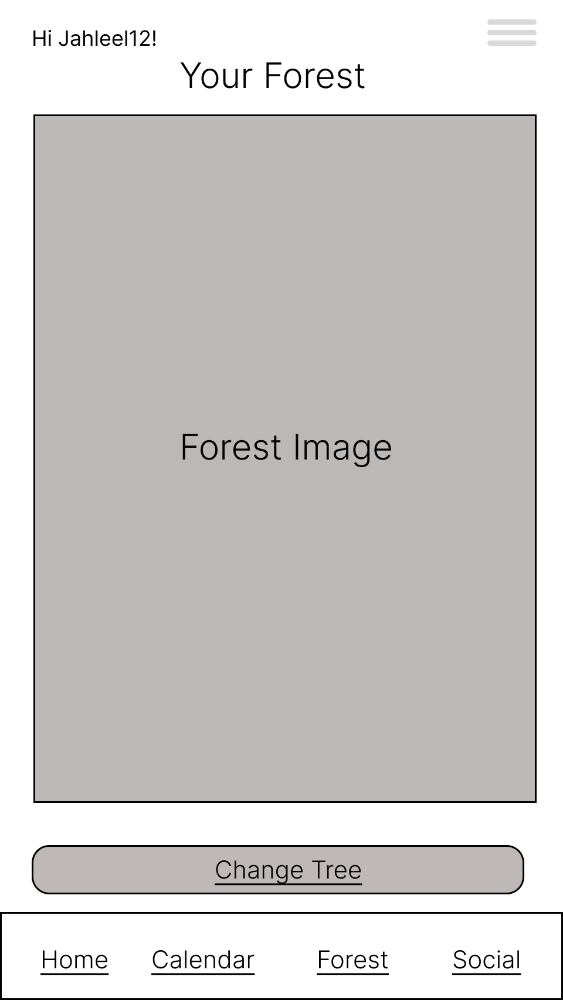
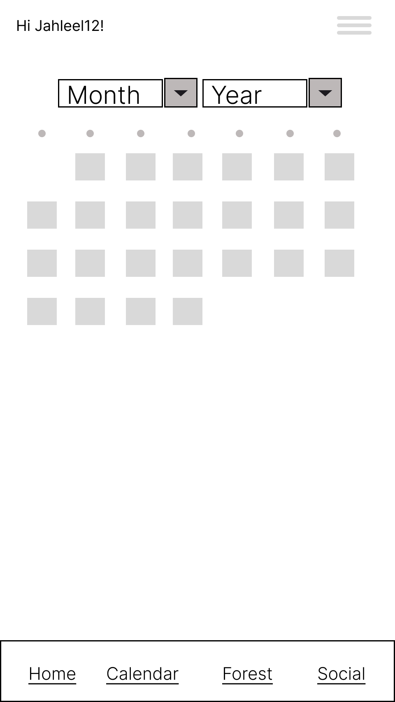
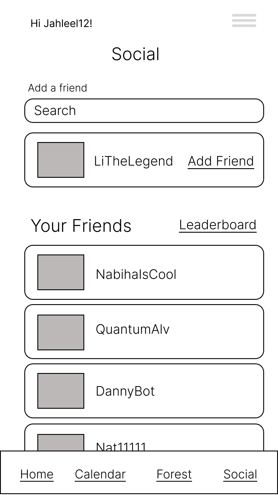
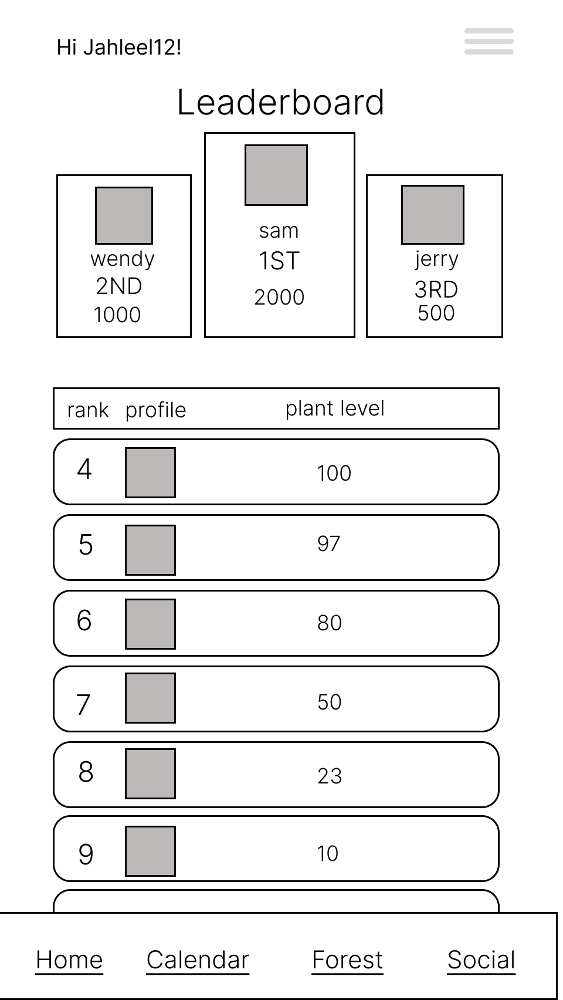

# UX Design Documentation

## App Overview
This document outlines the UX design for our application. Below, you will find an **app map** followed by detailed wireframes representing different screens of the app.

## App Map
Below is a structured representation of the app's navigation flow:

- **Login & Registration**
  - Login Page
  - Registration Page
  - Forgot Password
  - Password Reset Confirmation

- **Main Features**
  - Home Page
  - Forest (Main Tracking Screen)
  - Calendar
  - Social (Friends & Leaderboard)
  - Leaderboard

- **User Settings**
  - My Account
  - Change Password
  - Change Email

- **Additional Features**
  - Help Guide
  - Messages
  - Hamburger Menu (Navigation Sidebar)

## Wireframe Screens

### 1. Login Page
**Purpose:** Allows users to log in using their username and password. Also includes an option to reset a forgotten password.

### 2. Registration Page
**Purpose:** Enables new users to create an account by providing their details, including first name, last name, email, username, and password.

### 3. Forgot Password
**Purpose:** Helps users reset their password by entering their username and email address. A reset link is sent to their email.

### 4. Password Reset Confirmation
**Purpose:** Displays a confirmation message after a user requests a password reset.

### 5. Home Page
**Purpose:** The main screen where users track their hydration progress and interact with their virtual tree.

### 6. Forest Page
**Purpose:** Displays a visual representation of the user's progress with their tree.

### 7. Calendar
**Purpose:** Provides an overview of the user's hydration habits over time, showing past water intake records.

### 8. Social Page
**Purpose:** Allows users to add friends, view their friends' activity, and access the leaderboard.

### 9. Leaderboard
**Purpose:** Displays rankings based on user hydration progress, fostering friendly competition.

### 10. My Account
**Purpose:** Shows user profile information, including current streaks, total water intake, and account settings.

### 11. Change Password
**Purpose:** Allows users to update their password by entering their current and new passwords.

### 12. Change Email
**Purpose:** Enables users to update their email address. A verification process ensures security.

### 13. Help Guide
**Purpose:** Provides an overview of how the app works and how users can benefit from it.

### 14. Messages
**Purpose:** Displays messages and notifications related to the app's functionality.

### 15. Hamburger Menu
**Purpose:** Offers quick access to different app sections, including My Account, Privacy Policy, and Logout.

.png)

---

## Conclusion
This document serves as a reference for understanding the application's user experience and navigation. The wireframes above illustrate the essential screens, ensuring a seamless and intuitive user journey.
