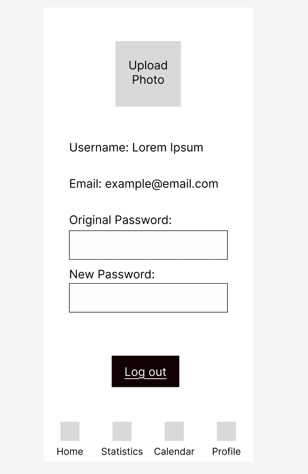

# User Experience Design
## Prototype Link
[Figma Prototype](https://www.figma.com/design/w75dJualN3GRN736hTw8Jw/Flipped-1?node-id=0-1&p=f&t=LXYn7RDy2oyUTvXP-0)
## App Map

## Wireframe Diagrams

### Login and Sign up

-Login page allows users to register if they are new to this application.

-Sign up page allows users to create a new account for this application.

### Profile

-Profile page allows users to check their basic information such as username, email and photo. Users could also change their password in this page.

### Home

-Home page allows users to manage and select their tasks to focus. Users could choose to click the add button in the upper right corner of the application to add a new tasks. According to the initial development concept, this app allows users to create and manage up to 10 tasks.

### Filp

-Filp page shows the specific task the user selected. The page was designed be able to switch between tasks and the current task name will be shown on the top of the page. 

Befor a peroid of flip and focusing, there will be a return home button for user to jump back to the home page.

During a peroid of flip, if user take off their phone, the application will show the time peroid and remind the user to flip back the phone to continue focus.

If the user didn't flip back their phone, the after flip page will show the user the time peroid and provide the option to flip again or go back to home page.

### Statistics

-Statistics page allows users to checked their focused periods.

Users are able to checked their concentration period in range of daily, weekly, monthly and yearly.

The upper bar shows their total time counting in the specific range, and the time distribution provided users with chart to see tasks percentages.

### Calendar

-Calendar pages allows users to view and check their schedule, along with their concentrated periods.

Users coudl add their schedule by click the add button in the upper right corner of the application. When edit an to do schedule, the user have to input the time and the period of the schedule, which will later synchronized on the calendar.

The calendar page have three views, which are daily, weekly, and monthly.

In the daily view, user could check their daily focused period and their daily to do. The period and to do are corresponding to the time line.

In the weekly view, user could check their to do in this week and check their daily focused time.

In the monthly view, user could check their everyday focused time and the sum of the month.

### Link to clickable Prototype

[Flipped Prototype](https://www.figma.com/proto/w75dJualN3GRN736hTw8Jw/Flipped-1?node-id=31-27&p=f&t=U13L3ftSDUrDNDTP-1&scaling=scale-down&content-scaling=fixed&page-id=0%3A1&starting-point-node-id=31%3A27)

This repository contains instructions and files for two assignments that together comprise the user experience design phase of a web app.

Replace the contents of this file with the completed assignments, as described in:

- [app map & wireframe instructions](instructions-0a-app-map-wireframes.md).
- [prototype instructions](instructions-0b-prototyping.md)
